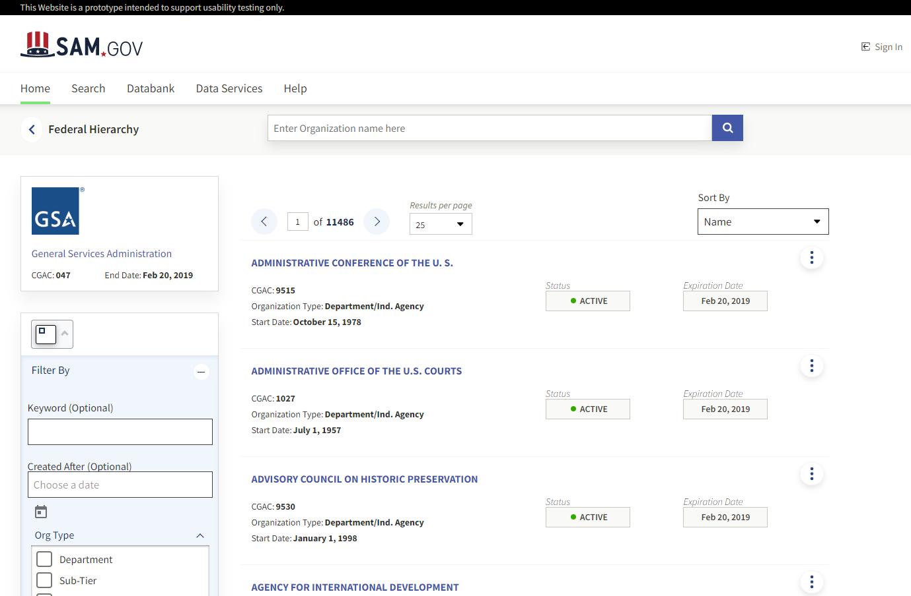
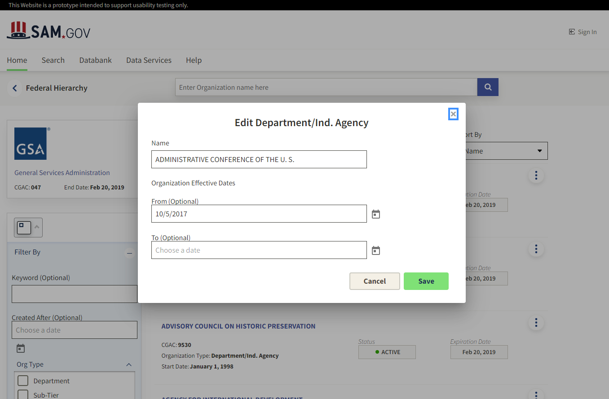
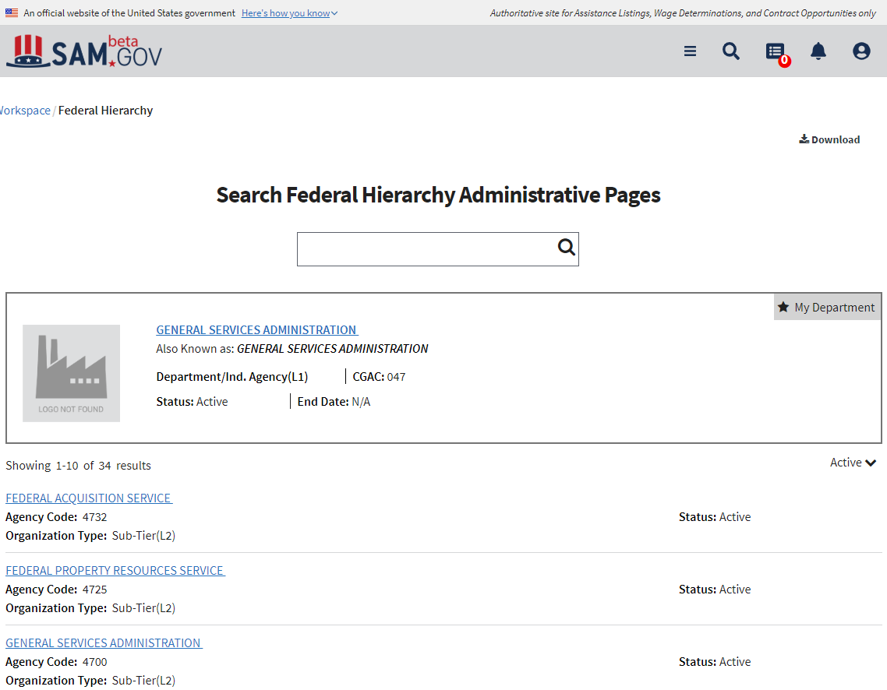

# GSA Design Challenge

## Team name

Team Rocket

## Members

* Bibek Regmi
* Andrew Tran
* Justin Babbs

## Project Description

Team Rocket implemented a redesign of the beta.sam.gov Federal Hierarchy landing page.

## Project Features

* A filter toolbar on the left side of the page
  * Toolbar uses conditional filtering to show/hide filters which aren't applicable. The AAC Code is only visible if
  * Filters are added to the browser history so that users can user the forward and back buttons of the browser to move back and forward between pages
  * Filters and pagination can be deep linked and bookmarked (/fh?offset=3&fhorgname=Parks)

* Pagination and sorting using SDS pagination component

* A subheader with keyword search
  * Users can search based on keyword
  * The browser history stores the search term, so users can user the back and forward buttons of the browsers to return to previous search results.

*A modal window to allow users to edit organization details.

## Screenshots

### New Landing Page

 

### New Organization Edit Modal

### Beta.Sam.Gov FH Landing Page

 
 
 We integrated several components Sam Design System library, and integrated several presentation components from ![SAM Styles)[https://federalist-0ad5a602-ca98-4a7e-8d6e-d9ece7bc4cf8.app.cloud.gov/site/gsa/sam-styles/index.html).

## Issues Encountered

### Minor Bugs

* The Formly multiselect 'templateOptions.label' isn't implemented. We had to use an accordion wrapper instead.
* The `<sds-filter>` Reset All button doesn't always clear all the inputs. It should empty all text inputs, and uncheck any checked items -- not reset them to the state they were in when the page loaded.
* The pagination component cannot be set to page size 10. It can only be set to page sizes of 25/50/100.
* An output event on 'Reset All' clicked for <sds-filter> would be helpful as clients might want different behavior on that click
* The current <sds-search> throws JS error when attempting to search with empty search text

### Major Bugs / Difficulties

#### `<sds-filter>` Limitations

By far, our biggest challenge was adding the filtering and pagination options to the browser history using url query params. We tried to take advantage of the history feature of the `<sds-filter>` component, but encountered several issues. We found that we could not set URL query parameters outside of the component. Doing so would break the history feature of the `<sds-filter>`.

As a possible solution, we propose that the history feature should be decoupled from the `<sds-filter>`. We needed a service to coordinate filter across the entire page -- not just within one `<sds-filter>` component.
