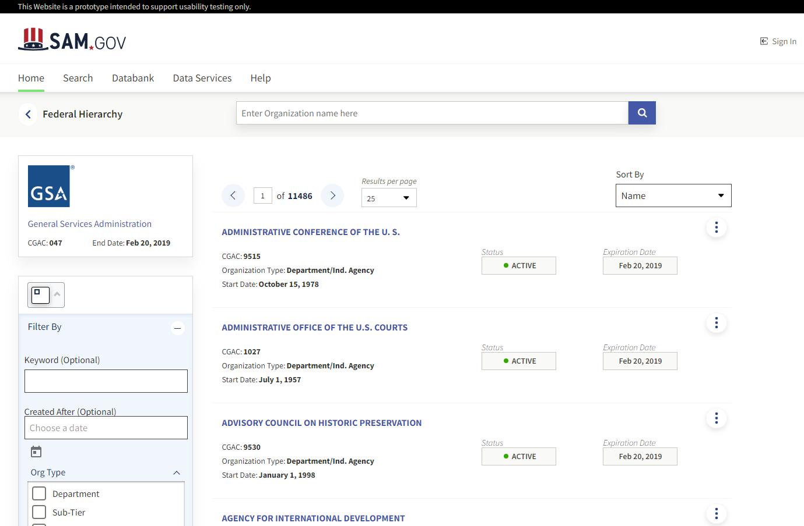
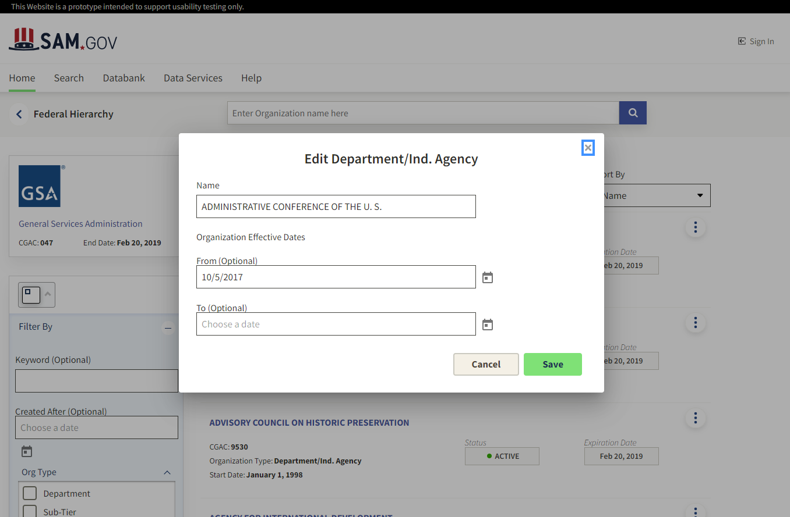
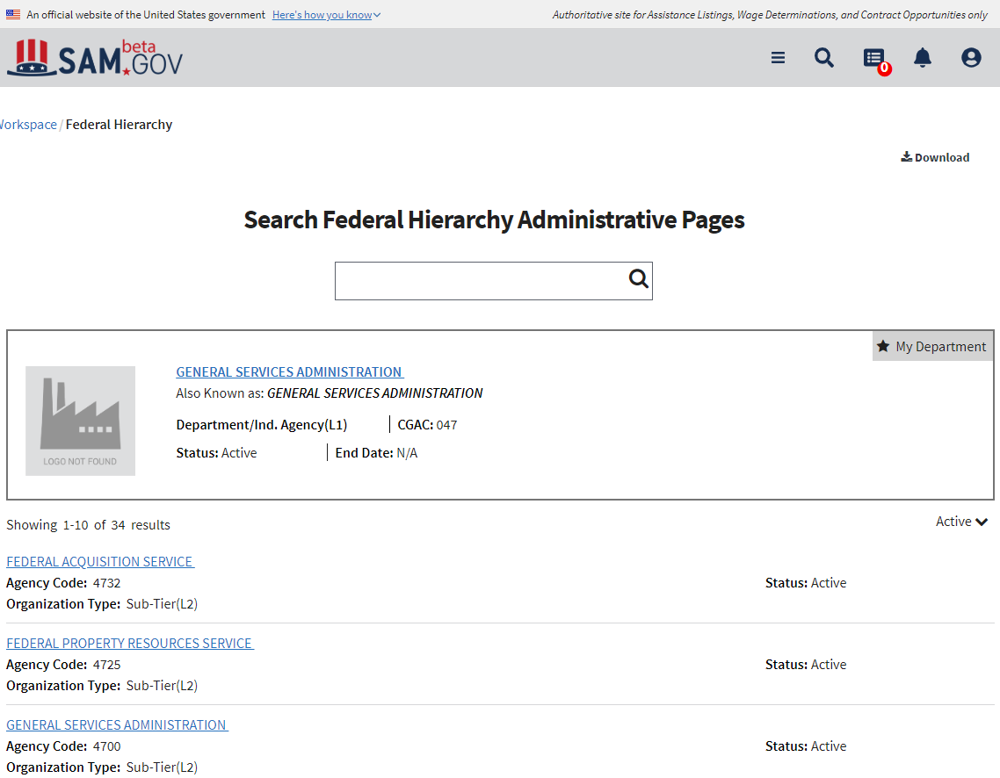

#GSA Design Challenge
##Team name
Team Rocket
##Members
* Bibek Regmi
* Andrew Tran
* Justin Babbs

##Project Description

Team Rocket implemented a redesign of the beta.sam.gov Federal Hierarchy landing page.

##Project Features
* A filter toolbar on the left side of the page
    * Toolbar uses conditional filtering to show/hide filters which aren't applicable. The AAC Code is only visible if   
    * Filters are added to the browser history so that users can user the forward and back buttons of the browser to move back and forward between pages
    * Filters and pagination can be deep linked and bookmarked (/fh?offset=3&fhorgname=Parks)
* A subheader with keyword search
    * Users can search based on keyword
    * The browser history stores the search term, so users can user the back and forward buttons of the browsers to return to previous search results.
* A modal window to allow users to edit organization details.

##Screenshots

### New Landing Page

 

### Org Edit Modal

### Existing Landing Page

 
 
 We integrated several components Sam Design System library, and integrated several presentation components from ![SAM Styles)[https://federalist-0ad5a602-ca98-4a7e-8d6e-d9ece7bc4cf8.app.cloud.gov/site/gsa/sam-styles/index.html).

##Issues Encountered
### Minor Bugs
* The Formly multiselect 'templateOptions.label' isn't implemented. We had to use an accordion wrapper instead.
* The <sds-filter> Reset All button doesn't clear all the inputs. It resets the form to the state it was when you load the page. It should empty all text inputs, and uncheck any checked items - not reset them to the state they were in when the page loaded.
* The pagination component does not allow us to set the page size to 10. It is hardcoded to allow only 25/50/100 results per page.
* It should be possible to hide the text "(Optional)" in the Formly config.

### Major Bugs / Difficulties

#### <sds-filter> Limitations
By far, our biggest challenge was adding the filtering and pagination options to the browser history using url query params. We tried to take advantage of the history feature of the <sds-filter> component, but encountered several issues. We found if we set URL query parameters, it would conflict with the filters functionality.

As a possible solution, we propose that the history feature should be decoupled from the <sds-filter>. We needed a separate service that allows coordinating filters across the entire page.

